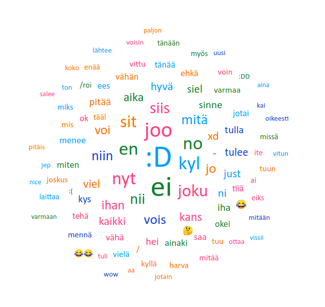

# Telegram word cloud
This project contains notebook written with js to create html-file that shows word cloud of exported Telegram chat history. Project depends on `jupyter` and `node`.

To create word cloud
- create `data` folder to root of this project
- export data from Telegram desktop app to data folder
- install dependencies with `npm install`
- set up node kernel for jypyter notebook
- run notebook with `jypyter-notebook wordcloud.ipynb`

See comments in `wordcloud.ipynb` for additional info. Result will be something like this\*:

\* Data in this image has been cleaned a bit to maintain privacy.

